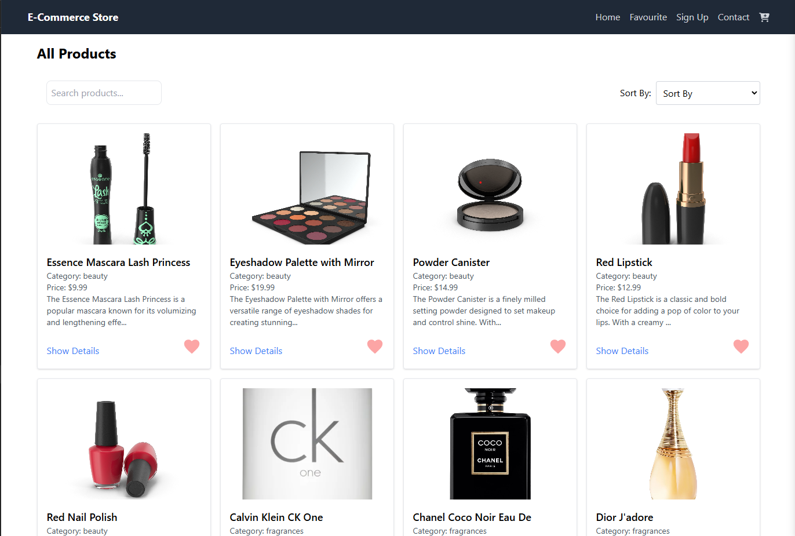
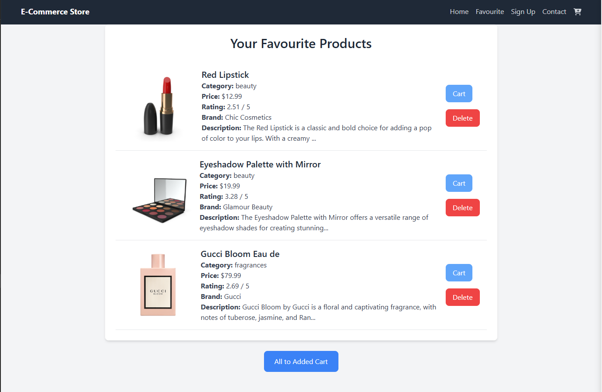
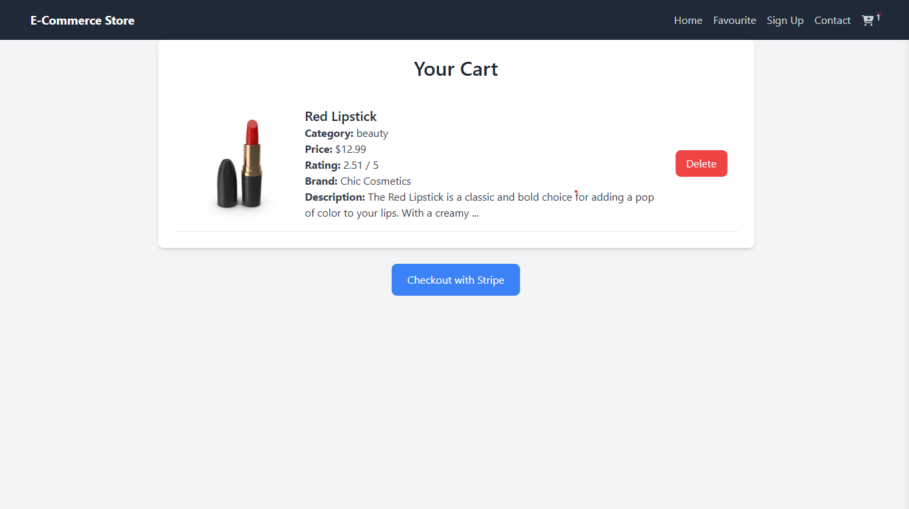

# 🌟 E-Commerce CRUD Web Application

---

## 📌 Project Overview

🎉 This is a sleek and modern **eCommerce CRUD web application** built with **React, Tailwind CSS, and Context API**. It features user authentication, advanced search and filtering, pagination, and a dynamic cart and favorite system, ensuring a smooth shopping experience.

## 🚀 Features

-   **Home Page** – Displays all products beautifully.
-   **Favorite Page** – Save your favorite products.
-   **Signup/Signin** – Secure login via email/password & Google authentication.
-   **Contact Page** – Get in touch with us easily.
-   **Cart Page** – Seamlessly add/remove products.
-   **Advanced Searching** – Quick and efficient product search.
-   **Customizable Sorting** – Sort products as per your preference.
-   **Pagination** – Browse effortlessly through large datasets.

---

## 🛠️ Technologies Used

-   **React.js** – Interactive frontend framework
-   **Tailwind CSS** – Elegant and responsive styling
-   **Context API** – Smooth state management
-   **Firebase** – Secure authentication
-   **React Router** – Fast page navigation

---

## 📸 Project Screenshots

-   **Home Page:**  
     

-   **Favorite Page:**  
     

-   **Cart Page:**  
     

---

## 💻 How to Run the Project

1.  **Clone the repository:**

        ```sh
        git clone <repository-url>
        ```

2.  **Navigate to the project directory:**

        ```sh
        cd ecommerce-project
        ```

3.  **Install dependencies:**

        ```sh
        npm install
        ```

4.  **Start the development server:**

        ```sh
        npm run dev
        ```

---
